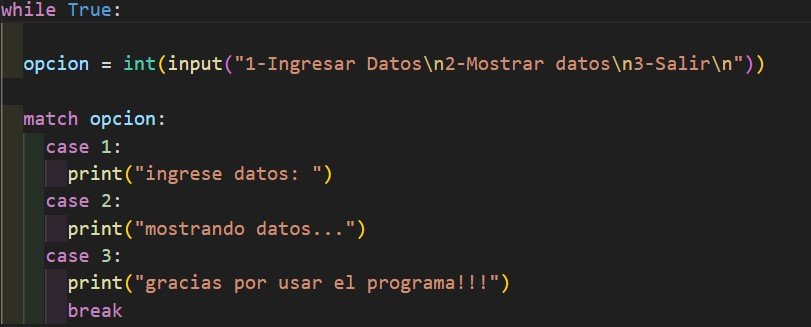

# Ejemplo Documentación 

## Integrantes 
- Matias Quiroz
- German Scarafilo
- Giovanni Lucchetta

## Proyecto: Menu.

## Descripción
En este parrafo deberan describir que funcion cumple su proyecto. Que solucion esta ofreciendo.

## Función principal
Este programa mustra un ejemplo de como utilizar el menu

(Breve del programa)

~~~ Python (lenguaje en el que esta escrito)
    while True:
      
      opcion = int(input("1-Ingresar Datos\n2-Mostrar datos\n3-Salir\n"))

      match opcion:
        case 1:
          print("ingrese datos: ")
        case 2:
          print("mostrando datos...")
        case 3:
          print("gracias por usar el programa!!!")
          break
~~~

## :snake: Link al proyecto
- [proyecto](https://onlinegdb.com/q3RGvZwgB)
## :tv: Link al video del proceso
- [video](https://www.youtube.com/watch?v=VyGjE8kx-O0)

---
### Fuentes

- [Lenguaje Markdown](https://markdown.es/sintaxis-markdown/#linkauto).

- [Markdown Cheatsheet](https://github.com/adam-p/markdown-here/wiki/Markdown-Cheatsheet).

- [Tutorial](https://www.youtube.com/watch?v=oxaH9CFpeEE).

- [Emojis](https://gist.github.com/rxaviers/7360908).

---

